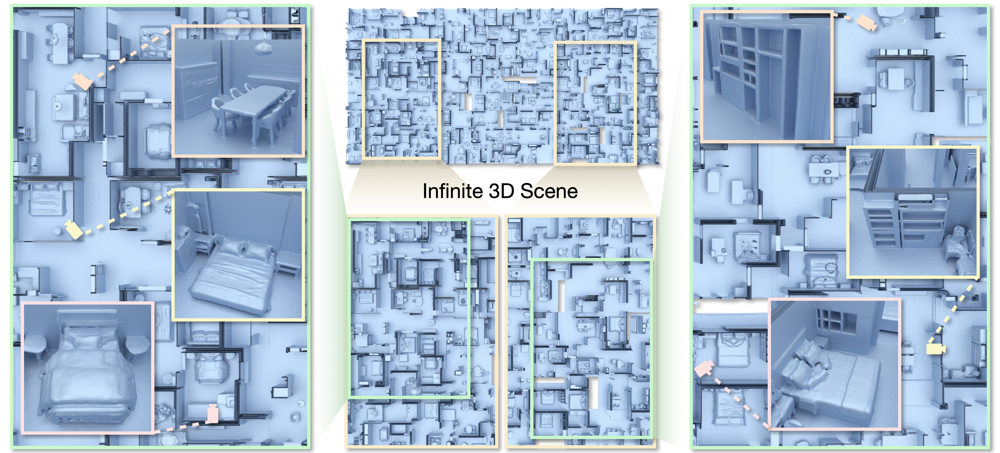

# LT3SD: Latent Trees for 3D Scene Diffusion
### [Project Page](https://quan-meng.github.io/projects/lt3sd/) | [Paper](http://arxiv.org/abs/2409.08215) | [Video](https://youtu.be/AJ5sG9VyjGA)



We present LT3SD, a novel latent diffusion model for large-scale 3D scene generation. 

Recent advances in diffusion models have shown impressive results in 3D object generation, but are limited in spatial extent and quality when extended to 3D scenes. To generate complex and diverse 3D scene structures, we introduce a latent tree representation to effectively encode both lower-frequency geometry and higher-frequency detail in a coarse-to-fine hierarchy. We can then learn a generative diffusion process in this latent 3D scene space, modeling the latent components of a scene at each resolution level. 

To synthesize large-scale scenes with varying sizes, we train our diffusion model on scene patches and synthesize arbitrary-sized output 3D scenes through shared diffusion generation across multiple scene patches. Through extensive experiments, we demonstrate the efficacy and benefits of LT3SD for large-scale, high-quality unconditional 3D scene generation and for probabilistic completion for partial scene observations.

## News
- 2025-02-27: Code coming soon!
- 2025-05-26: Code released!

## Installation
```
# Clone the repo:
git clone --recursive https://github.com/quan-meng/lt3sd.git

# Create a conda environment
conda create --name lt3sd python=3.10; conda activate lt3sd

# Install the dependencies
pip install -r requirements.txt
```

## Data Processing
First, you need to apply for the [3D-FUTURE](https://tianchi.aliyun.com/specials/promotion/alibaba-3d-scene-dataset#) dataset and unzip `3D-FUTURE-model.zip;`, `3D-FRONT-texture.zip`, and `3D-FRONT.zip`. Remember to modify the output directory `Front3D.root_dir` in `configs/dataset`. Then, run the following command to export the scene meshes and compute TUDF voxel grids to `Front3D.root_dir`. 
```
# Export scene meshes
python data/export_mesh.py export_houses --output_semantic_bbox --add_floor 

# Install SDFGen (CPU-Only)
cd third_parties/sdf-gen
mkdir build && cd build
cmake ..
make
cp -r bin/sdf_gen ../../../tools

# Export UDF voxel grids (Export as .npy files)
python data/export_volume.py --voxel_size 0.022 --num_level 4 --with_bbox

```
Note that some scenes with incorrect furniture scales will cause OOM error and be skipped automatically.

## Training
### First Stage 
```
python first_stage.py --slurm.slurm_job_name 'train_1st_stage' --slurm.gpus_per_node 1 --slurm.slurm_constraint '[rtx_a6000]' --slurm.nodes 2 --levels 'tudf_0p088_0p176' 'tudf_0p022_0p088'
```
Remember to specify the training log path `FirstStage.log_dir` in `configs/opt`. The GPU memory cost is ~13GB with batch_size of 4. 

### Second Stage
```
python second_stage.py --slurm.slurm_job_name 'train_2nd_stage' --slurm.gpus_per_node 1 --slurm.slurm_constraint '[rtx_a6000]' --slurm.nodes 2 --first_stage_dir <FIRST-STAGE-DIR> --levels 'tudf_0p088_0p176' 'tudf_0p022_0p088' --batch_size 8 --model.chunk_shape 32 16 32 --model.start_level 'tudf_0p088_0p176' model.first-stage-config:ae
```
Where you replace `<FIRST-STAGE-DIR>` with the log_dir of the first stage. The GPU memory cost is ~25GB with batch_size of 8. 

## Pretrained Models
The pretrained checkpoint is provided [here](https://1drv.ms/f/c/e762fb0a44e578db/Eis8AmcZJ1BPgen4-3zCvrwBu88wl9q7V-wChTM3m1fbOQ?e=b4VCul):
- First Stage: tudf_0p088_0p176 and tudf_0p022_0p088
- Second Stage: TODO

Please download the checkpoints and unzip it to ./checkpoints. 

## Generation
You can now generate new scenes with pretrained models. To generate a batch of 3D scenes with the shape of (256, 128, 256)
```
python second_stage.py --slurm.slurm_job_name 'train_2nd_stage' --slurm.gpus_per_node 1 --slurm.slurm_constraint '[rtx_a6000]' --slurm.nodes 1 --first_stage_dir <FIRST-STAGE-DIR> --levels 'tudf_0p088_0p176' 'tudf_0p022_0p088' --batch_size 8 --resume <SECOND-STAGE-DIR> --model.chunk_shape 32 16 32 --model.start_level 'tudf_0p088_0p176' model.first-stage-config:ae task:generation --task.scene_shape 256 128 256
```
Where you replace `<FIRST-STAGE-DIR>` with the log_dir of the first stage (./checkpoints/240711-202423) and `<SECOND-STAGE-DIR>` with log_dir of the second stage.

## Citation
If you find our work useful in your research, please consider citing:

	@misc{meng2024lt3sdlatenttrees3d,
		title={LT3SD: Latent Trees for 3D Scene Diffusion}, 
		author={Quan Meng and Lei Li and Matthias Nießner and Angela Dai},
		journal={arXiv preprint arXiv:2409.08215},
		year={2024}
	}

## Acknowledgements
This repository builds upon the following excellent open-source projects: [LDMs](https://github.com/CompVis/latent-diffusion), [MultiDiffusion](https://github.com/omerbt/MultiDiffusion), and [SDFusion](https://github.com/yccyenchicheng/SDFusion). 
